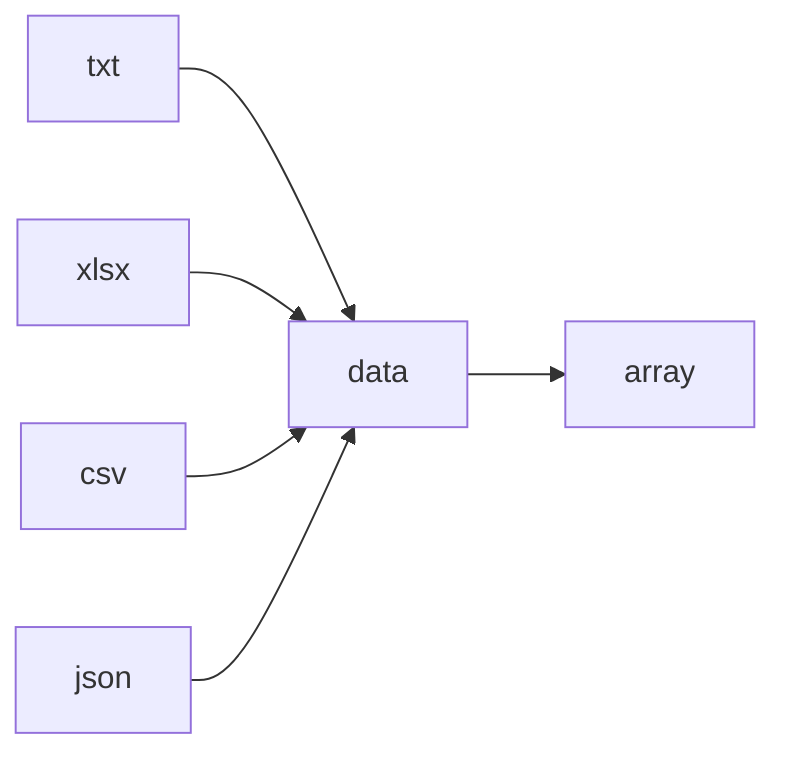
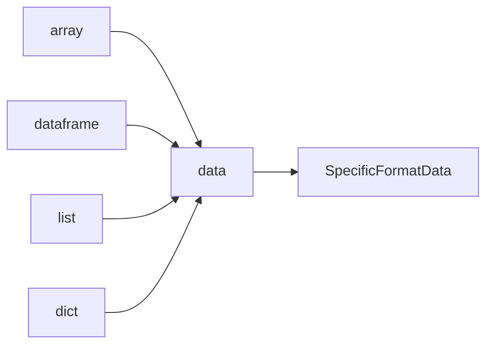
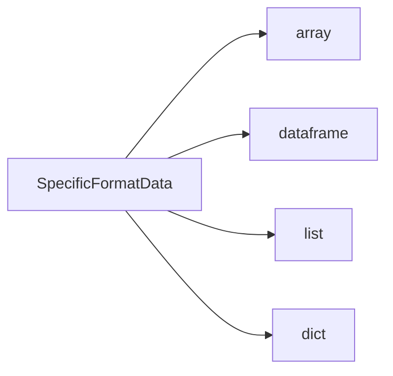
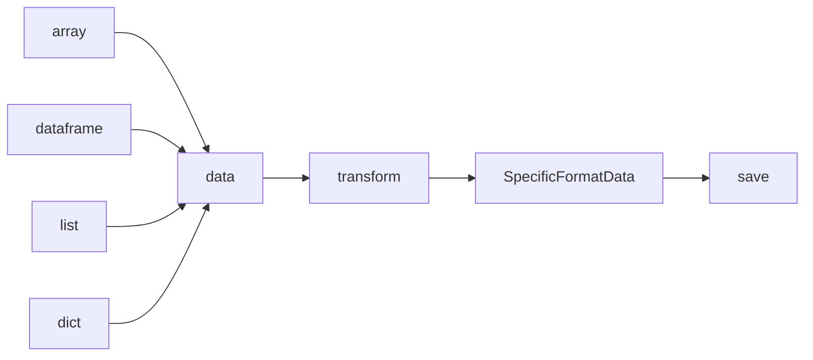

# dataito模块架构图

- read( )

```mermaid
graph LR
    txt --> data
    xlsx --> data
    csv --> data
    json --> data
    data --> array
```

- transform( )

```mermaid
graph LR
    array --> data
    dataframe --> data
    list --> data
    dict --> data
    data --> SpecificFormatData
  
```

```mermaid
graph LR
	SpecificFormatData  --> array
	SpecificFormatData  --> dataframe
	SpecificFormatData  --> list
	SpecificFormatData --> dict
```

- save()

```mermaid
graph LR
    array --> data
    dataframe --> data
    list --> data
    dict --> data
    data --> transform
    transform --> SpecificFormatData
    SpecificFormatData --> save
```

